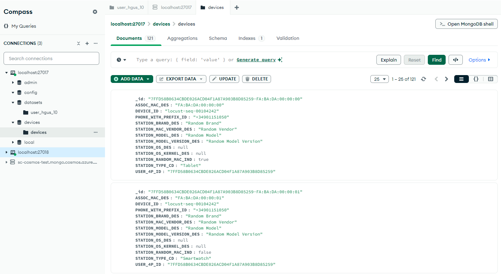
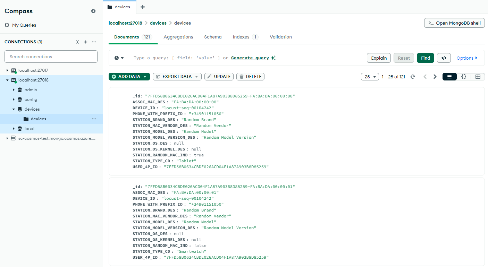

# MongoDB Standard Dump and Restore

## Table of Contents

1. Installation
2. Files
   - [utilities/MongoDBDeleter.py](utilities/MongoDBDeleter.py)
   - [generate_dump.sh](generate_dump.sh)
   - [restore.sh](restore.sh)
3. Running the example

## Installation

- Clone the repository.

    ```bash
    git clone https://github.com/idb-antonioalanis/MongoDB-Standard-Dump-and-Restore.git
    ```

- Navigate to the project directory.

    ```bash
    cd MongoDB-Standard-Dump-and-Restore
    ```

- Make sure you have Python 3.6 or higher installed. You can install it via `apt`.

    ```bash
    sudo apt update && \
    sudo apt install -y python3
    ```

- Once Python installed, get the required dependencies.

    ```bash
    pip install -r requirements.txt
    ```

- Also make sure you have Docker installed on your machine. You can install it via `apt` too.

    ```bash
    sudo apt update && \
    sudo apt install docker.io
    ```

## Files

### [utilities/MongoDBDeleter.py](utilities/MongoDBDeleter.py)

Before the creation of [user-hgus-10.json](example/user-hgus-10.json), there was a file called **user-hgus.json** containing approximately 120,000 documents. The large size of this file made it cumbersome for testing purposes, and the sheer volume of data made deletion inefficient.

This is where [MongoDBDeleter](utilities/MongoDBDeleter.py) comes into play. It allows preserving the desired number of documents, while efficiently deleting the others.

```bash
$ python ./utilities/MongoDBDeleter.py

MongoDB connection URI (default: mongodb://localhost:27017/) > 
Database name > test
Collection name > test
Number of documents to preserve > 100

[Info] Connecting to 'mongodb://localhost:27017/'...
[Success] Connected to the database.

[Info] The collection has 26000 documents in total.
[Info] 25900 documents will be deleted.

[Info] 1000 documents deleted on this batch. 1000 documents deleted.
[Info] 1000 documents deleted on this batch. 2000 documents deleted.
[Info] 1000 documents deleted on this batch. 3000 documents deleted.
[Info] 1000 documents deleted on this batch. 4000 documents deleted.
...
[Info] 1000 documents deleted on this batch. 23000 documents deleted.
[Info] 1000 documents deleted on this batch. 24000 documents deleted.
[Info] 1000 documents deleted on this batch. 25000 documents deleted.
[Info] 900 documents deleted on this batch. 25900 documents deleted.

[Success] 100 documents preserved.
[Info] Connection to the database closed.
```

### [generate_dump.sh](generate_dump.sh)

This script creates a MongoDB backup from a specified collection.

It automatically installs any missing tools, like `mongosh` and `mongodb-org-tools`, to ensure a smooth backup process.

The following parameters are required to run the script.

- **`-u`** - MongoDB connection URI (default: `mongodb://localhost:27017/`)
- **`-d`** - Database to back up
- **`-c`** - Collection to back up

**Example usage**

```bash
$ ./generate_dump.sh -d 'devices' -c 'devices'

[Info] mongosh is already installed.
[Info] mongodb-org-tools is already installed.

[Info] Connecting to 'mongodb://localhost:27017/'...
[Success] Connected to the database.

[Info] Checking if database 'devices' and collection 'devices' exist...
[Info] Database 'devices' and collection 'devices' exist.

[Info] Generating backup for 'devices.devices' in 'data/dump'...

2024-10-09T14:17:59.905+0200    writing devices.devices to data/dump/devices/devices.bson.gz
2024-10-09T14:17:59.924+0200    done dumping devices.devices (121 documents)

[Success] Backup completed successfully. Dump saved to 'data/dump'.
```

### [restore.sh](restore.sh)

This script restores a MongoDB database from a backup file generated by [generate_dump.sh](generate_dump.sh). It also includes the option to restore indexes or not, depending on the configuration provided.

Like the backup script, it automatically installs missing tools to ensure a seamless restore process.

The following parameters are required to run the script.

- **u** - MongoDB connection URI (default: mongodb://localhost:27017/)
- **d** - Database to restore (required)
- **p** - Path to the dump directory (required)
- **i** - Restore indexes (yes|no) (default: no)

**Example usage**

```bash
$ ./restore.sh -u 'mongodb://localhost:27018/' -d 'devices' -p './data/dump/devices' -i 'yes'

[Info] mongosh is already installed.
[Info] mongodb-org-tools is already installed.

[Info] Connecting to 'mongodb://localhost:27018/'...
[Success] Connected to the database.

[Info] Restoring the dump from './data/dump/devices' to database 'devices'...

2024-10-09T14:26:05.689+0200    building a list of collections to restore from data/dump/devices dir
2024-10-09T14:26:05.701+0200    reading metadata for devices.devices from data/dump/devices/devices.metadata.json.gz
2024-10-09T14:26:05.744+0200    restoring devices.devices from data/dump/devices/devices.bson.gz
2024-10-09T14:26:05.759+0200    finished restoring devices.devices (121 documents, 0 failures)
2024-10-09T14:26:05.759+0200    no indexes to restore for collection devices.devices
2024-10-09T14:26:05.760+0200    121 document(s) restored successfully. 0 document(s) failed to restore.

[Success] Database restore completed successfully.
```

## Running the example

To execute the example, you must to follow the next steps.

1. Invoke the two databases using the [docker-compose.yml](example/docker-compose.yml) file.

    ```bash
    cd example
    docker compose up
    ```

2. Create a new database in [mongodb://localhost:27017/](mongodb://localhost:27017/) called `datasets` within a collection called `user_hgus_10`.

    <p align="left">
        
    </p>

3. Export the [user-hgus-10.json](example/user-hgus-10.json) file into the `user_hgus_10` collection.

    <p align="center">
        
    </p>

4. Extract the devices using the [extract_devices.py](example/extract_devices.py) script.

    ```bash
    $ python ./example/extract_devices.py
    ```
    
    ```bash
    MongoDB connection URI (default: mongodb://localhost:27017/) > 
    Source database name (default: datasets) > 
    Source collection name (default: user_hgus_10) > 
    Target database name (default: devices) > 
    Target collection name (default: devices) > 

    [Info] Connecting to 'mongodb://localhost:27017/'...
    [Success] Connected to the database.
    [Info] 121 devices found.
    [Success] Data inserted in 'devices' collection.
    [Info] Connection to the database closed.
    ```

    <p align="center">
        
    </p>

5. Generate the dump using the [generate_dump.sh](./generate_dump.sh) script.

    ```bash
    $ ./generate_dump.sh -d 'devices' -c 'devices'
    ```

    <p align="left">
        
    </p>

6. Restore the backup file in [mongodb://localhost:27018/](mongodb://localhost:27018/) using the [restore.sh](./restore.sh) script.

    ```bash
    $ ./restore.sh -u 'mongodb://localhost:27018/' -d 'devices' -p './data/dump/devices'
    ```

    <p align="center">
        
    </p>
